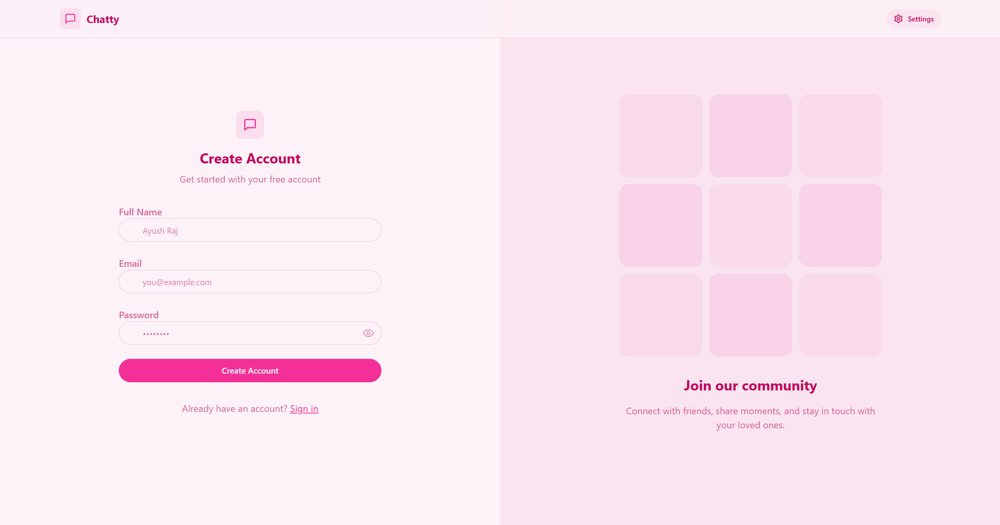
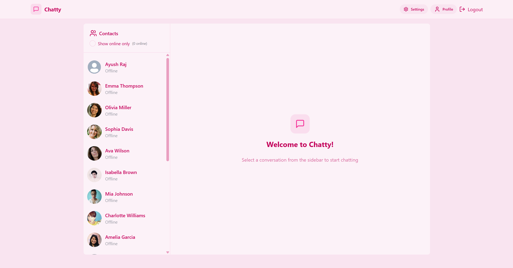
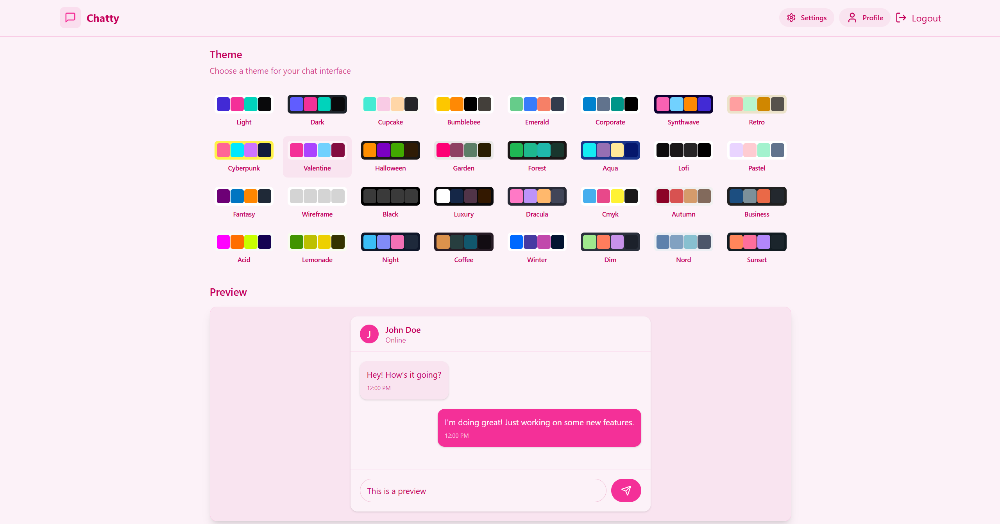

# 💬 Real-Time Chat Application

A full-stack real-time chat application built with **MERN Stack** (MongoDB, Express.js, React.js, Node.js) and **Socket.IO**, allowing users to sign up, log in, and chat in real-time with other registered users.

## 🚀 Features

- 🔐 User authentication (JWT-based)
- 👤 User profile management
- 📡 Real-time one-to-one messaging using Socket.IO
- 🟢 Online/offline user status indicators
- 📄 Message persistence with MongoDB
- 📦 REST API with Express.js
- 💅 Styled using Tailwind CSS
- 🌐 Fully responsive UI

## 🛠️ Tech Stack

**Frontend:**
- React.js
- Tailwind CSS
- Axios

**Backend:**
- Node.js
- Express.js
- MongoDB (with Mongoose)
- Socket.IO
- JSON Web Tokens (JWT)

## ⚙️ Installation

### Prerequisites

- Node.js & npm
- MongoDB (local or Atlas)
- Git

### Clone the Repo

```bash
git clone https://github.com/rajayush16/Real-Time-Chat-Application.git
cd Real-Time-Chat-Application
```

### Backend Setup

```bash
cd backend
npm install
# Create a .env file 
npm run dev
```

### Frontend Setup

```bash
cd frontend
npm install
npm run dev
```

## 🌍 Environment Variables

Create a `.env` file in the `backend/` directory:

```
PORT=5000
MONGODB_URI=<your_mongodb_connection_string>
JWT_SECRET=<your_secret_key>
CLOUDINARY_CLOUD_NAME=<your_cloud_name>
CLOUDINARY_API_KEY=<your_api_key>
CLOUDINARY_API_SECRET=<your_api_secret>
```

## 📸 Screenshots

| Signup Page | Chat Interface | Settings Page |
|-------------|----------------| --------------|
|  |  |  |

## 🧠 Learning Objectives

- Understand the integration of WebSocket (Socket.IO) for real-time communication.
- Implement secure authentication with JWT.
- Build RESTful APIs and connect them with frontend React components.
- Manage application state in a real-time interactive environment.

## 📚 Resources

- [Socket.IO Documentation](https://socket.io/docs/)
- [MongoDB Docs](https://www.mongodb.com/docs/)
- [React Docs](https://reactjs.org/)
- [Express.js Docs](https://expressjs.com/)

## 🙋‍♂️ Author

**Ayush Raj**  
[LinkedIn](https://www.linkedin.com/in/ayush-raj-722446260) • [GitHub](https://github.com/rajayush16)

